[github](https://github.com/akshitbhandaricodes) &nbsp;·&nbsp;
[x](https://x.com/akshitbhandarix) &nbsp;·&nbsp;
[linkedin](https://www.linkedin.com/in/akshitbhandaricodes) &nbsp;·&nbsp;
[email](mailto:akshitbhandaricodes@gmail.com)

> CS student at Dronacharya College of Engineering, expected 2028. 
> Full Stack Intern at Webdesino & former Frontend Developer Intern at Octalucent.

I build scalable, performant systems and pixel-perfect UIs. Right now I'm 
working on distributed systems, event-driven architectures, and building products 
with robust RESTful APIs and modern frontend design.

<samp>next.js &nbsp; react &nbsp; typescript &nbsp; node.js &nbsp; postgresql &nbsp; docker &nbsp; kubernetes &nbsp; aws &nbsp; redis &nbsp; tailwindcss</samp>

**[Prod2Push](https://github.com/akshitbhandaricodes)** &nbsp;·&nbsp; <samp>next.js, node.js, kubernetes</samp> 
Scalable PaaS deployment platform using a Next.js/Node.js stack. 
Automated CI/CD with Docker-in-Docker and Kubernetes for orchestration.

**[SnipWise](https://github.com/akshitbhandaricodes)** &nbsp;·&nbsp; <samp>javascript, node.js, indexeddb</samp> 
Privacy-first, lightweight Chrome extension for high-speed capture. 
Offline-first architecture with zero-trust data privacy.

**[Katove Marketplace](https://github.com/akshitbhandaricodes)** &nbsp;·&nbsp; <samp>react.js, supabase, postgresql</samp> 
High-performance marketplace ecosystem with component-driven React architecture. 
Secure OAuth workflows and Row Level Security implementation.

**mofa-org/mofa** &nbsp;·&nbsp; <samp>testing, c++</samp> 
Implemented Agent testing framework, failure injection, rate limiting. 
Added test report generator, JUnit formatters, and mock verification macros.

**mofa-org/mofaclaw** &nbsp;·&nbsp; <samp>systems, rust</samp> 
Implemented Pull Request review skill and GitHub CI/CD status slash commands. 
Optimized directory traversal syscalls and cached regexes via LazyLock.

Every graphic here is generated, not embedded from anyone else's server. 
`ascii.svg` is a photo pushed through a character ramp by 
[`scripts/make_portrait.py`](scripts/make_portrait.py); the stat graphics and 
these section headings are drawn by [a scheduled action](.github/workflows/stats.yml) 
straight from the GitHub GraphQL API, once a day, committing only what changed.

They animate with SMIL inside the SVG, because GitHub strips scripts from 
READMEs — and since nothing loads from a third party, nothing here can 
rate-limit or go dark. The headings are SVGs for the same reason: GitHub also 
strips CSS, so an image is the only way to put this page's own typeface on them.

The typeface is [JetBrains Mono](scripts/fonts), subset to just the characters 
each graphic draws and inlined as base64. That isn't only for looks: the 
portrait's grid assumes an advance width of exactly 0.600 em, and a viewer whose 
default monospace is narrower would otherwise see it squeezed.

Language totals cover public repositories only. `year.svg` uses the portrait's 
character ramp: `:` `+` `#` `@`, quiet to loud.
